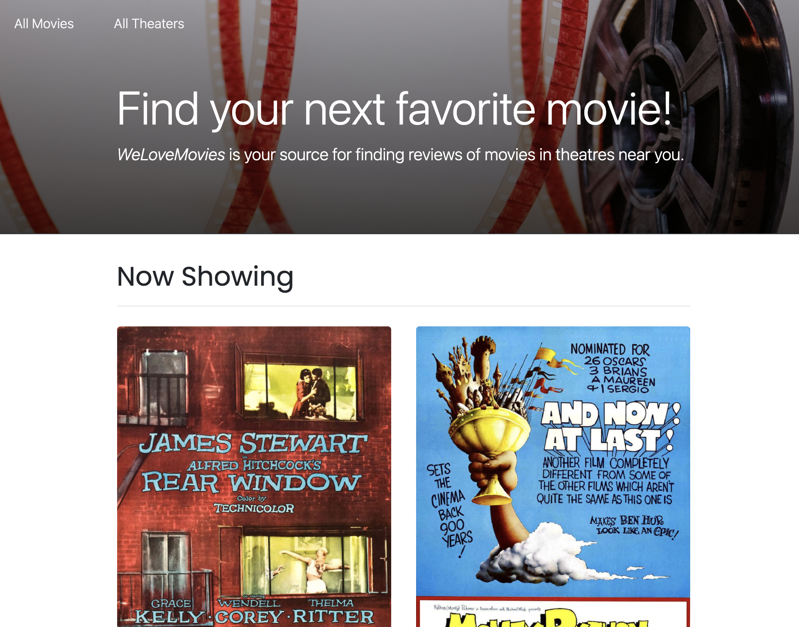

# Theater Movie Selection Backend Server

### Table of Contents

- [Live Application](#live-application)
- [Description](#description)
- [Technologies](#technologies)
- [How To Use](#how-to-use)
- [Application Features](#application-features)
- [License](#license)
- [Author Info](#author-info)

## Live Application

This application can be viewed here: N/A

## Description

This application runs as a website where you can view movie selections at select theater locations. Each movie contains a descriptions as well as reviews from various critics. Reviews can be edited and even deleted as needed.

## Technologies

- Backend API setup
- Creating RESTful APIs
- Using Express for middleware request and response handling
- Implementing PostgreSQL servers
- Using Knex.js to configure migrations

## How To Use

#### Installation:

1. Fork and clone this repository
2. Run `npm install` to install project dependencies
3. Run `npm start` to start your server

## Application Features

### Homepage

View all movies that are currenting showing in theaters.

### All Movies

This link located at the top of the screen allows the user to view all movies regardless if they are currently showing in a theater or not.

### All Theaters

This link located at the top of the screen allows the user to view all movies currently playing at each theater as well as the address of each theater.

### View a Specific Movie

Gives information on the movie such as title, description, runtime (in minutes), rating, review score, theaters currently showing, as well as reviews from critics.

### Delete Reviews

The user has the ability to delete or "destroy" reviews if desired.

### Rate Reviews

The user has the ability to rate reviews itself, which can bring the average review rating of the movie up or down.

## License

MIT License

Copyright (c) [2021] [Miki Saarna]

Permission is hereby granted, free of charge, to any person obtaining a copy
of this software and associated documentation files (the "Software"), to deal
in the Software without restriction, including without limitation the rights
to use, copy, modify, merge, publish, distribute, sublicense, and/or sell
copies of the Software, and to permit persons to whom the Software is
furnished to do so, subject to the following conditions:

The above copyright notice and this permission notice shall be included in all
copies or substantial portions of the Software.

THE SOFTWARE IS PROVIDED "AS IS", WITHOUT WARRANTY OF ANY KIND, EXPRESS OR
IMPLIED, INCLUDING BUT NOT LIMITED TO THE WARRANTIES OF MERCHANTABILITY,
FITNESS FOR A PARTICULAR PURPOSE AND NONINFRINGEMENT. IN NO EVENT SHALL THE
AUTHORS OR COPYRIGHT HOLDERS BE LIABLE FOR ANY CLAIM, DAMAGES OR OTHER
LIABILITY, WHETHER IN AN ACTION OF CONTRACT, TORT OR OTHERWISE, ARISING FROM,
OUT OF OR IN CONNECTION WITH THE SOFTWARE OR THE USE OR OTHER DEALINGS IN THE
SOFTWARE.

## Author Info

- GitHub: [miki-saarna](https://github.com/miki-saarna)
- LinkedIn: [Mikito Saarna](https://www.linkedin.com/in/mikito-saarna/)
- Website: [MikiSaarna.com](https://MikiSaarna.com)

[Back To The Top](#theater-movie-selection-backend-server)